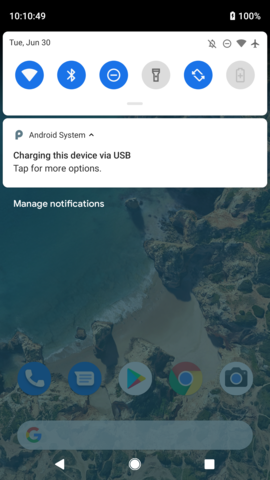
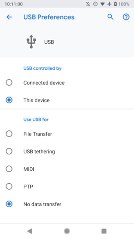
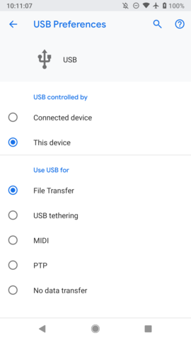
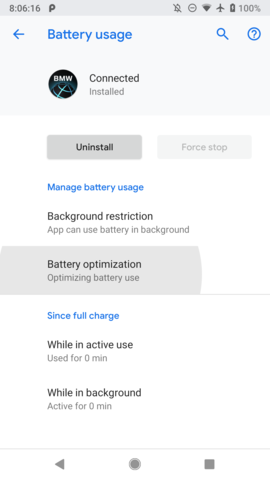
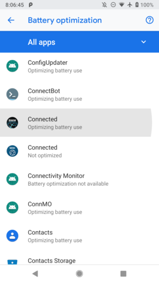
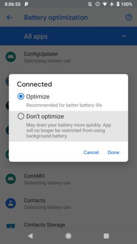
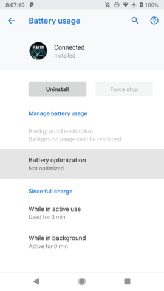

The official Connected app provides the connection for phone apps to show up in your car, including the Connected Calendar, Spotify, and AndroidAutoIdrive. Here are some tips to make this connection more reliable:

# USB

The USB method is very reliable. Some phones, however, default to USB Charging Only mode. You may need to switch the phone to File Transfer mode to start up the apps connection.

# Bluetooth

Bluetooth support is flakier than USB, but is more convenient when it works and is required for advanced audio functionality. If the Apps connection didn't automatically connect, it should connect successfully if the Music connection is toggled from the car: An event listener in the Connected phone app initializes the Apps connection right when the A2DP music protocol is connected.

To improve reliability for Bluetooth connections, you should add the Connected app to the whitelist to prevent the phone from [killing the app](https://dontkillmyapp.com/).

Some phones might apply their own restrictions, so [check this site](https://dontkillmyapp.com/) for more tips specific to your phone.
