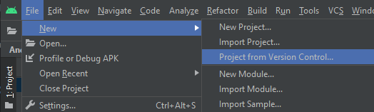
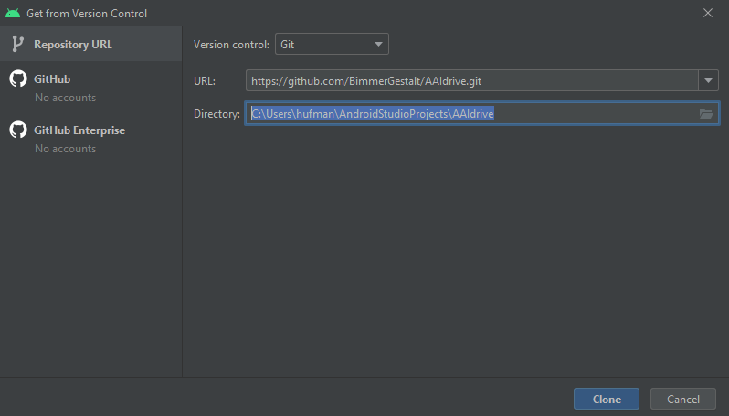
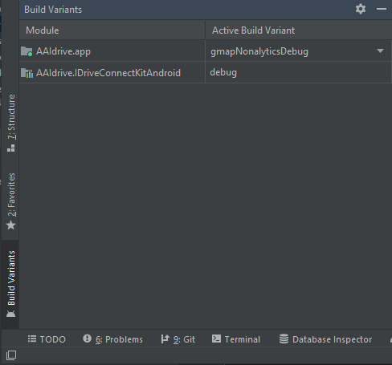
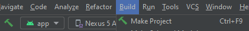
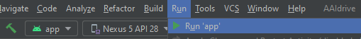

AAIdrive is an open source project that everyone is allowed to compile and modify.
As an Android app, it relies on Gradle to download the dependencies and manage the build steps, and provides integration into Android Studio.
Gradle can sometimes get cranky and need fixing, but most Gradle problems can usually get resolved.

## Preparation

1. Set up Android Studio, which is the easiest way to build Android apps. Gradle can be used manually too, but configuring the Android SDKs is trickier that way.
2. Follow the instructions in [external/README.md](https://github.com/BimmerGestalt/AAIdrive/tree/main/external) to downloaded the needed APK files from official apps. These will be placed in the `external` directory after the app source code is downloaded.
3. (To enable gmap build) Add a [Google Maps API key](https://developers.google.com/maps/documentation/android-sdk/signup) to `~/.gradle/gradle.properties` as a property named `AndroidAutoIdrive_GmapsApiKey`.
    - No spaces or quotes are needed around the property value: `AndroidAutoIdrive_GmapsApiKey=AIza...`
    - This key should have access to Maps SDK for Android, Places API, and Directions API.
    - Billing is needed for the Places API to return search results, but there is a generous free tier.
4. (To enable mapbox build) Add two [Mapbox Access Tokens](https://docs.mapbox.com/android/maps/guides/install/#configure-credentials) to `~/.gradle/gradle.properties`:
    - The public token with all the public scopes should be named like so: `AndroidAutoIdrive_MapboxAccessToken=pk.ey...`
    - The secret token with the private `Downloads:Read` scope should be named like so: `AndroidAutoIdrive_MapboxDownloadToken=sk.ey...`
5. (Optional) Add a [Spotify API Client ID](https://developer.spotify.com/dashboard/) to `~/.gradle/gradle.properties` as a property named `AndroidAutoIdrive_SpotifyApiKey`.
    - If you don't want to set up a Spotify API key, set your Gradle like so: `AndroidAutoIdrive_SpotifyApiKey=unset`
    - The client secret is not needed, and no spaces or quotes are needed around the property value: `AndroidAutoIdrive_SpotifyApiKey=36b6...`
    - It needs the Redirect URI set to `me.hufman.androidautoidrive://spotify_callback`
    - It may also need the package fingerprint added, [follow these instructions](https://developer.spotify.com/documentation/android/quick-start/) to configure it
6. (Optional) Add a Sentry DSN to `~/.gradle/gradle.properties` as a property named `AndroidAutoIdrive_SentryDsn` to capture crash reports.
    - No spaces or quotes are needed around the DSN: `AndroidAutoIdrive_SentryDsn=https://e40...@sentry.io/0123...`

These API keys can be set directly in the `gradle.properties` in the repository, but this will add complications when updating the code or submitting pull requests.

## Download Source Code

  - Android Studio makes it easy to check out this project:
    - File > New > Project From Version Control > Git

    

    

    - Next, copy the APKs from the preparation steps to the `externals` folder of the project. If you try to build without them, you would receive the following error:

    

  - The project can also be cloned with Git manually:
    - `git clone --recursive https://github.com/BimmerGestalt/AAIdrive.git && cd AAIdrive`
    - `git submodule init && git submodule update`
    - Copy the APKs from the preparation steps to the `externals` folder of the new repository

The Github Download Zip option is not recommended, because it does not include the `.git` metadata for easy updates.

## Build the Project
  - Using Android Studio:
    - Use the Build Variants panel at the bottom left to change which version is built

    

    - Build > Make Project to build the APK artifacts

    

    - Plug in your phone and click Run

    

  - Alternatively, using Gradle manually:
    - Make sure Android SDK Build Tools version 30 is installed
    - `./gradlew assembleNomapNonalyticsFullDebug`
    
The built APKs should be found in `app/build/outputs/apk/*/*/*.apk`

## Developing IDriveConnectKit

For the convenience and speed of building the app, the project is set up to rely on pre-built releases of the IDriveConnectKit and IDriveConnectKitAndroid helper libraries.
However, some advanced development tasks (such as editing these libraries and testing the overall app with the changes) are facilitated by using a local development copy of these libraries instead.
To convert an AAIdrive checkout to use local submodule clones of these libraries, a few steps must be done:

  - Optionally move to a separate development branch: `git checkout -b branch_name`
  - git submodule add https://github.com/BimmerGestalt/IDriveConnectKit.git
  - git submodule add https://github.com/BimmerGestalt/IDriveConnectKitAndroid.git
  - Change the top-level `settings.gradle` file to include these new modules:
    `include ':app', ':spotify-app-remote', ':IDriveConnectKit', ':IDriveConnectKitAndroid'`
  - Change the `app/build.gradle` file to use the modules instead of the Gradle artifacts:

```diff
-    implementation 'io.bimmergestalt:IDriveConnectKit:0.3'
-    implementation 'io.bimmergestalt:IDriveConnectKitAndroid:0.2'
-    testImplementation 'io.bimmergestalt:IDriveConnectKit:0.3'
-    androidTestImplementation 'io.bimmergestalt:IDriveConnectKit:0.3'
-    androidTestImplementation 'io.bimmergestalt:IDriveConnectKitAndroid:0.2'
+    implementation project(path: ':IDriveConnectKit')
+    implementation project(path: ':IDriveConnectKitAndroid')
+    testImplementation project(path: ':IDriveConnectKit')
+    androidTestImplementation project(path: ':IDriveConnectKit')
+    androidTestImplementation project(path: ':IDriveConnectKitAndroid')
```

  - Tell Android Studio to File > Sync Project with Gradle Files

Most of these steps are provided by a [helpful commit](https://github.com/BimmerGestalt/AAIdrive/commit/example-submodules) in the AAIdrive repo:

  - Optionally move to a separate development branch: `git checkout -b branch_name`
  - Apply the change to use submodules for these libraries:
    `git cherry-pick origin/example-submodules`
  - Update the submodules to make sure they are at the latest version:
    `git submodule update --remote`
  - Tell Android Studio to File > Sync Project with Gradle Files

Now, the IDriveConnectKit and IDriveConnectKitAndroid directories will be used to build the project, and so any changes there will be included during development.
Regular submodule caveats apply: They are (by default) on Detached Heads, so they'll need to be moved to a branch for development and patch submission.