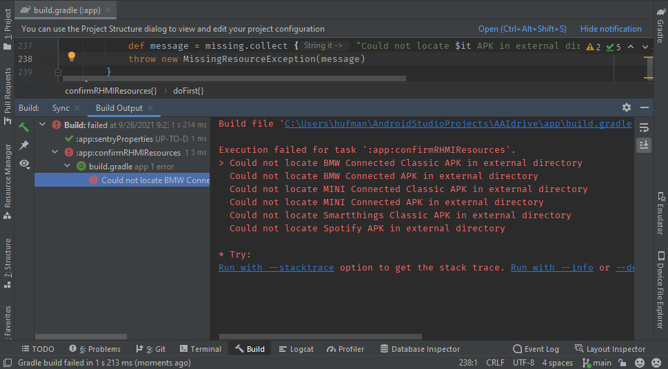

AAIdrive is an open source project that everyone is allowed to compile and modify.
As an Android app, it relies on Gradle to download the dependencies and manage the build steps, and provides integration into Android Studio.
Gradle can sometimes get cranky and need fixing, but most Gradle problems can usually get resolved.

## Preparation

1. Set up Android Studio, which is the easiest way to build Android apps. Gradle can be used manually too, but configuring the Android SDKs is trickier that way.
2. Follow the instructions in [external/README.md](https://github.com/BimmerGestalt/AAIdrive/tree/main/external) to downloaded the needed APK files from official apps. These will be placed in the `external` directory after the app source code is downloaded.
3. (Optional) Add a [Google Maps API key](https://developers.google.com/maps/documentation/android-sdk/signup) to `~/.gradle/gradle.properties` as a property named `AndroidAutoIdrive_GmapsApiKey`.
    - No spaces or quotes are needed around the property value: `AndroidAutoIdrive_GmapsApiKey=AIza...`
    - This key should have access to Maps SDK for Android, Places API, and Directions API.
    - Billing is needed for the Places API to return search results, but there is a generous free tier.
4. (Optional) Add a [Spotify API Client ID](https://developer.spotify.com/dashboard/) to `~/.gradle/gradle.properties` as a property named `AndroidAutoIdrive_SpotifyApiKey`.
    - The client secret is not needed, and no spaces or quotes are needed around the property value: `AndroidAutoIdrive_SpotifyApiKey=36b6...`
    - It needs the Redirect URI set to `me.hufman.androidautoidrive://spotify_callback`
    - It may also need the package fingerprint added, [follow these instructions](https://developer.spotify.com/documentation/android/quick-start/) to configure it
5. (Optional) Add a Sentry DSN to `~/.gradle/gradle.properties` as a property named `AndroidAutoIdrive_SentryDsn` to capture crash reports.
    - No spaces or quotes are needed around the DSN: `AndroidAutoIdrive_SentryDsn=https://e40...@sentry.io/0123...`

These API keys can be set directly in the gradle.properties in the repository, but this will add complications when updating the code or submitting pull requests.

## Download Source Code

  - Android Studio makes it easy to check out this project:
    - File > New > Project From Version Control > Git

    

    

    - Next, copy the APKs from the preparation steps to the `externals` folder of the project. If you try to build without them, you would receive the following error:

    

  - The project can also be cloned with Git manually:
    - `git clone --recursive https://github.com/BimmerGestalt/AAIdrive.git && cd AAIdrive`
    - `git submodule init && git submodule update`
    - Copy the APKs from the preparation steps to the `externals` folder of the new repository

The Github Download Zip option is not recommended, because it does not include the `.git` metadata for easy updates.

## Build the Project
  - Using Android Studio:
    - Use the Build Variants panel at the bottom left to change which version is built

    

    - Build > Make Project to build the APK artifacts

    

    - Plug in your phone and click Run

    

  - Alternatively, using Gradle manually:
    - Make sure Android SDK Build Tools version 30 is installed
    - `./gradlew assembleNomapNonalyticsFullDebug`
    
The built APKs should be found in `app/build/outputs/apk/*/*/*.apk`
