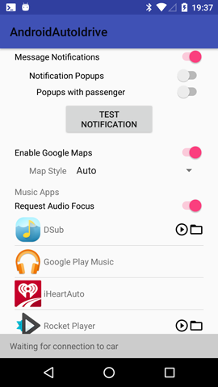
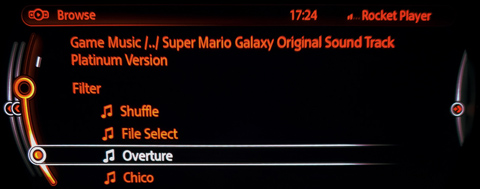

### Gallery

<figure>
	
	<figcaption>Phone App Interface</figcaption>
</figure>
<figure>
	
	<figcaption>Music App List</figcaption>
</figure>
<figure>
	
	<figcaption>Music Playback Interface</figcaption>
</figure>
<figure>
	
	<figcaption>Music Browsing</figcaption>
</figure>

## Demo Videos

<figure>
	<video src="demo-notifications.mp4" alt="Notifications" autoplay muted controls loop width="480" height="200"></video>
	<figcaption>New phone notifications pop up in the dashboard and can be interacted with</figcaption>
</figure>
<figure>
	<video src="demo-applist.mp4" alt="App List" autoplay muted controls loop width="480" height="200"></video>
	<figcaption>Android Auto music apps are added as music sources to the car</figcaption>
</figure>
<figure>
	<video src="demo-browse.mp4" alt="Browse" autoplay muted controls loop width="480" height="200"></video>
	<figcaption>Navigates each app's music library</figcaption>
</figure>
<figure>
	<video src="demo-filter.mp4" alt="Filter" autoplay muted controls loop width="480" height="200"></video>
	<figcaption>Easy filtering of long browse lists</figcaption>
</figure>
<figure>
	<video src="demo-nowplaying.mp4" alt="Now Playing" autoplay muted controls loop width="480" height="200"></video>
	<figcaption>Select from a list of currently-queued songs</figcaption>
</figure>
<figure>
	<video src="demo-actions.mp4" alt="App Actions" autoplay muted controls loop width="480" height="200"></video>
	<figcaption>Supports app-specific song actions</figcaption>
</figure>

